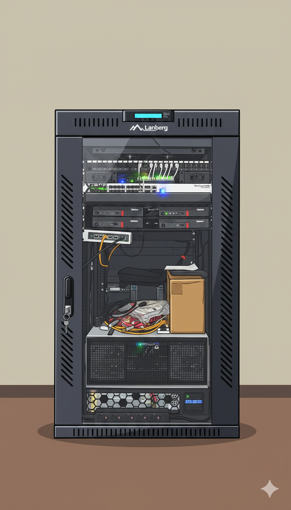
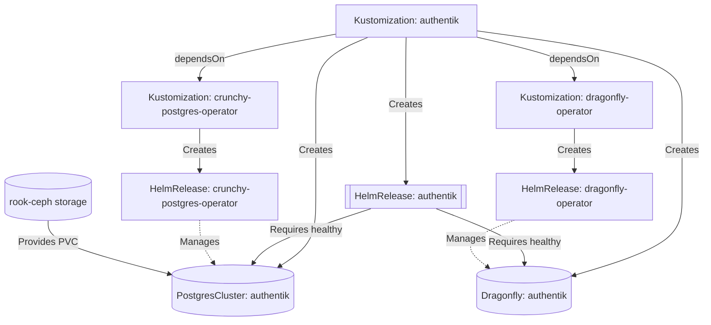

<div align="center">


###  My Home Operations Repository 

_... managed with Flux, Renovate, and GitHub Actions_ 

</div>

<div align="center">

[](https://discord.gg/home-operations)&nbsp;&nbsp;
[](https://talos.dev)&nbsp;&nbsp;
[](https://kubernetes.io)&nbsp;&nbsp;
[](https://fluxcd.io)&nbsp;&nbsp;
[](https://github.com/vrozaksen/renovate-config/actions/workflows/renovate.yaml)

</div>

<div align="center">

[](https://status.vzkn.eu)&nbsp;&nbsp;
[](https://status.vzkn.eu/endpoints/infrastructure_flux-webhook)&nbsp;&nbsp;

</div>

<div align="center">

[](https://github.com/kashalls/kromgo)&nbsp;&nbsp;
[](https://github.com/kashalls/kromgo)&nbsp;&nbsp;
[](https://github.com/kashalls/kromgo)&nbsp;&nbsp;
[](https://github.com/kashalls/kromgo)&nbsp;&nbsp;
[](https://github.com/kashalls/kromgo)&nbsp;&nbsp;
[](https://github.com/kashalls/kromgo)&nbsp;&nbsp;
[](https://github.com/kashalls/kromgo)
</div>

---


<div style="margin-bottom: 24px;">
  <h2>Overview</h2>
  <p>
    This is a monorepository is for my home kubernetes clusters.<br>
    I try to adhere to Infrastructure as Code (IaC) and GitOps practices using tools like <a href="https://www.terraform.io/">Terraform</a>, <a href="https://kubernetes.io/">Kubernetes</a>, <a href="https://github.com/fluxcd/flux2">Flux</a>, <a href="https://github.com/renovatebot/renovate">Renovate</a>, and <a href="https://github.com/features/actions">GitHub Actions</a>.<br><br>
    The purpose here is to learn k8s, while practicing Gitops.
  </p>
</div>

<table>
<tr>
<td width="35%" align="center">

## 🖥 Server Rack



</td>
<td width="65%">

## 🔧 Hardware

### Main Kubernetes Cluster

| Name    | Device       | CPU      | OS Disk   | Data Disk  | RAM  | OS    | Purpose     |
|---------|--------------|----------|-----------|------------|------|-------|-------------|
| Alfheim | Lenovo M720q | i5-8500T | 480GB SSD | 500GB NVME | 64GB | Talos | k8s control |
| Alne    | Lenovo M720q | i5-8500T | 480GB SSD | 500GB NVME | 32GB | Talos | k8s control |
| Ainias  | Lenovo M720q | i5-8500T | 480GB SSD | 500GB NVME | 32GB | Talos | k8s control |

**Totals:** 18 CPU threads, 128 GB RAM
**Network:** Intel X710-DA2 (LACP 2x10Gbps 802.3ad)

### NAS

| Name    | CPU      | RAM  | OS     | Storage                                                               | Purpose              |
|---------|----------|------|--------|-----------------------------------------------------------------------|----------------------|
| Aincrad | i3-14100 | 32GB | Unraid | **Array:** 5x14TB + 5x4TB ZFS<br>**Cache:** 1TB M.2 SSD<br>**Blaze Pool:** 2x960GB SSD RAID1 | NAS/NFS/S3/Backup    |

**Components:** AsRock B760M-H2/M.2, Corsair Vengeance DDR5 6000MHz, Inter-Tech 4U Case, 2x ASM1166 HBA
**GPU:** ASUS GeForce RTX 3060 Phoenix V2 LHR 12GB GDDR6 (ML/LLM)

### Networking/UPS Hardware

| Device                             | Purpose          |
|------------------------------------|------------------|
| MikroTik RB5009UPr+S+IN            | Router           |
| MikroTik CRS326-24S+2Q+RM          | 10G Switch       |
| HORACO 2.5GbE 5-Port + 10G SFP+    | 2.5G Switch      |
| APC SMC1500I-2UC                   | UPS              |

</td>
</tr>
</table>

---

## ⛵ Kubernetes

My Kubernetes clusters are deployed with [Talos](https://www.talos.dev). One is a low-power utility cluster, running important services,
and the other is a semi-hyper-converged cluster, workloads and block storage are sharing the same available resources on my nodes while
I have a separate NAS with ZFS for NFS/SMB shares, bulk file storage and backups.

There is a template over at [onedr0p/cluster-template](https://github.com/onedr0p/cluster-template) if you want to try and follow along
with some of the practices I use here.

### Core Components

- [actions-runner-controller](https://github.com/actions/actions-runner-controller): self-hosted Github runners
- [cilium](https://github.com/cilium/cilium): internal Kubernetes networking plugin
- [cert-manager](https://cert-manager.io/docs/): creates SSL certificates for services in my cluster
- [external-dns](https://github.com/kubernetes-sigs/external-dns): automatically syncs DNS records from my cluster ingresses to a DNS provider
- [external-secrets](https://github.com/external-secrets/external-secrets/): managed Kubernetes secrets using [1Password](https://1password.com/).
- [ingress-nginx](https://github.com/kubernetes/ingress-nginx/): ingress controller for Kubernetes using NGINX as a reverse proxy and load balancer
- [rook-ceph](https://rook.io/): Cloud native distributed block storage for Kubernetes
- [spegel](https://github.com/XenitAB/spegel): stateless cluster local OCI registry mirror
- [tofu-controller](https://github.com/weaveworks/tf-controller): additional Flux component used to run Terraform from within a
  Kubernetes cluster.
- [volsync](https://github.com/backube/volsync): backup and recovery of persistent volume claims

### GitOps

[Flux](https://github.com/fluxcd/flux2) watches the clusters in my [kubernetes](./kubernetes/) folder (see Directories below) and makes
the changes to my clusters based on the state of my Git repository.

The way Flux works for me here is it will recursively search the `kubernetes/apps` folder until it finds the most top level
`kustomization.yaml` per directory and then apply all the resources listed in it. That aforementioned `kustomization.yaml` will generally
only have a namespace resource and one or many Flux kustomizations (`ks.yaml`). Under the control of those Flux kustomizations there will
be a `HelmRelease` or other resources related to the application which will be applied.

[Renovate](https://github.com/renovatebot/renovate) watches my **entire** repository looking for dependency updates, when they are found
a PR is automatically created. When some PRs are merged Flux applies the changes to my cluster.

### Directories

This Git repository contains the following directories under [Kubernetes](./kubernetes/).

```sh
📁 kubernetes
├── 📁 apps       # applications
├── 📁 components # re-useable kustomize components
└── 📁 flux       # flux system configuration
```

### Flux Workflow

This diagram illustrates how Flux manages application deployments with complex dependencies. In this scenario:

1. `Kustomization` resources depend on other `Kustomization` resources
2. `HelmRelease` resources depend on custom resources (`PostgresCluster`/`Dragonfly`)
3. Operators manage stateful components that applications require

The workflow ensures **Authentik won't deploy** until:

- The PostgreSQL operator is installed and ready
- The Dragonfly operator is installed and ready
- A dedicated PostgreSQL cluster for Authentik is provisioned and healthy
- A Dragonfly caching instance is provisioned and healthy



### Networking

<details>
  TBD
</details>

---

## ☁️ Cloud Dependencies

While most of my infrastructure and workloads are self-hosted I do rely upon the cloud for certain key parts of my setup.
This saves me from having to worry about two things. (1) Dealing with chicken/egg scenarios and (2) services I critically need whether
my cluster is online or not.

The alternative solution to these two problems would be to host a Kubernetes cluster in the cloud and deploy applications like
[HCVault](https://www.vaultproject.io/), [Vaultwarden](https://github.com/dani-garcia/vaultwarden), [ntfy](https://ntfy.sh/), and
[Gatus](https://gatus.io/). However, maintaining another cluster and monitoring another group of workloads is a lot more time and effort
than I am willing to put in.

| Service                                     | Use                                                               | Cost          |
|---------------------------------------------|-------------------------------------------------------------------|---------------|
| [Bitwarden](https://bitwarden.com/)         | Secrets with [External Secrets](https://external-secrets.io/)     | ~$10/yr       |
| [Cloudflare](https://www.cloudflare.com/)   | Domain, DNS, WAF and R2 bucket (S3 Compatible endpoint)           | ~$30/yr       |
| [GitHub](https://github.com/)               | Hosting this repository and continuous integration/deployments    | Free          |
| [Healthchecks.io](https://healthchecks.io/) | Monitoring internet connectivity and external facing applications | Free          |
|                                             |                                                                   | Total: ~$3,3/mo |

---

## 🌐 DNS

In my cluster there are two instances of [ExternalDNS](https://github.com/kubernetes-sigs/external-dns) running. One for syncing
private DNS records to my `AdGuard Home` using [ExternalDNS webhook provider for AdGuard](https://github.com/muhlba91/external-dns-provider-adguard),
while another instance syncs public DNS to `Cloudflare`. This setup is managed by creating ingresses with two specific classes: `internal`
for private DNS and `external` for public DNS. The `external-dns` instances then syncs the DNS records to their respective platforms accordingly.

---

## ⭐ Stargazers

<div align="center">

[](https://star-history.com/#vrozaksen/home-ops&Date)

</div>

---

## 🤝 Thanks

Big shout out to the [cluster-template](https://github.com/onedr0p/cluster-template), and the [Home Operations](https://discord.gg/home-operations)
Discord community. Be sure to check out [kubesearch.dev](https://kubesearch.dev/) for ideas on how to deploy applications or get ideas
on what you may deploy.
