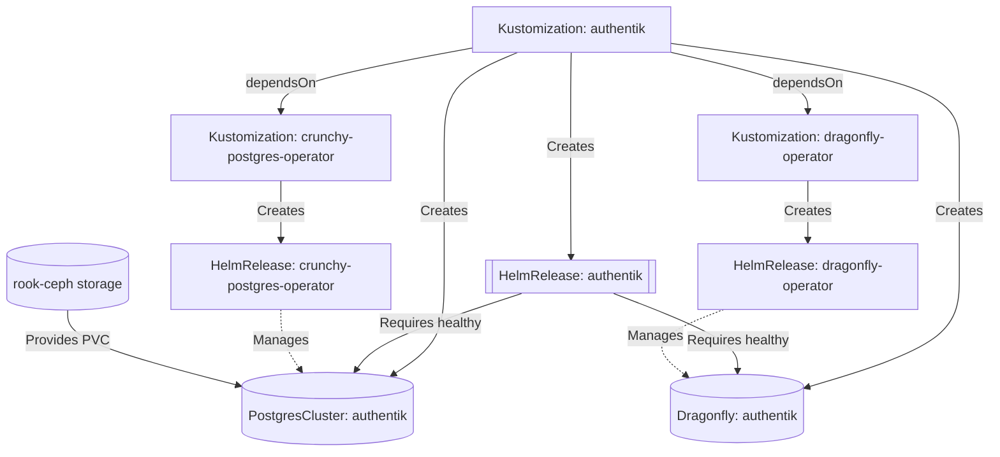

###  My Home Operations Repository 

_... managed with Flux, Renovate, and GitHub Actions_ 

&nbsp;&nbsp;
&nbsp;&nbsp;
&nbsp;&nbsp;
&nbsp;&nbsp;

&nbsp;&nbsp;
&nbsp;&nbsp;

&nbsp;&nbsp;
&nbsp;&nbsp;
&nbsp;&nbsp;
&nbsp;&nbsp;
&nbsp;&nbsp;
&nbsp;&nbsp;

---

## 📖 Overview

This is a monorepository is for my home kubernetes clusters.
I try to adhere to Infrastructure as Code (IaC) and GitOps practices using tools like [Terraform](https://www.terraform.io/),
[Kubernetes](https://kubernetes.io/), [Flux](https://github.com/fluxcd/flux2), [Renovate](https://github.com/renovatebot/renovate),
and [GitHub Actions](https://github.com/features/actions).

The purpose here is to learn k8s, while practicing Gitops.

---

## ⛵ Kubernetes

My Kubernetes cluster is deployed with [Talos](https://www.talos.dev) - a semi-hyper-converged setup where workloads and block storage share resources on the nodes, with a separate NAS providing NFS/SMB shares and backups.

### Core Components

- [actions-runner-controller](https://github.com/actions/actions-runner-controller): Self-hosted GitHub runners
- [cilium](https://github.com/cilium/cilium): Internal Kubernetes networking (CNI)
- [cert-manager](https://cert-manager.io/docs/): SSL certificates management
- [envoy-gateway](https://gateway.envoyproxy.io/): Ingress controller (Gateway API)
- [external-dns](https://github.com/kubernetes-sigs/external-dns): Automatic DNS records management
- [external-secrets](https://github.com/external-secrets/external-secrets/): Kubernetes secrets from [Bitwarden Secrets Manager](https://bitwarden.com/products/secrets-manager/)
- [rook-ceph](https://rook.io/): Distributed block storage
- [spegel](https://github.com/spegel-org/spegel): Stateless cluster local OCI registry mirror
- [tofu-controller](https://github.com/flux-iac/tofu-controller): Terraform/OpenTofu controller for Flux
- [volsync](https://github.com/backube/volsync): Backup and recovery of PVCs

### GitOps with Flux

[Flux](https://github.com/fluxcd/flux2) continuously reconciles this Git repository with the cluster state. [Renovate](https://github.com/renovatebot/renovate) automatically creates PRs for dependency updates. Learn more about Flux at [fluxcd.io/docs](https://fluxcd.io/flux/concepts/).

### Flux Workflow

This diagram shows how Flux handles complex application dependencies. In this example, Authentik deployment waits for:
- PostgreSQL and Dragonfly operators to be installed
- Database and cache instances to be provisioned and healthy

---

## 🌐 Networking

Network infrastructure is managed via Terraform. See [vrozaksen/mikrotik-terraform](https://github.com/vrozaksen/mikrotik-terraform) for details.

---

## ☁️ Cloud Dependencies

While most of my infrastructure and workloads are self-hosted I do rely upon the cloud for certain key parts of my setup.
This saves me from having to worry about two things. (1) Dealing with chicken/egg scenarios and (2) services I critically need whether
my cluster is online or not.

The alternative solution to these two problems would be to host a Kubernetes cluster in the cloud and deploy applications like
[HCVault](https://www.vaultproject.io/), [Vaultwarden](https://github.com/dani-garcia/vaultwarden), [ntfy](https://ntfy.sh/), and
[Gatus](https://gatus.io/). However, maintaining another cluster and monitoring another group of workloads is a lot more time and effort
than I am willing to put in.

| Service                                     | Use                                                               | Cost          |
|---------------------------------------------|-------------------------------------------------------------------|---------------|
| [Bitwarden](https://bitwarden.com/)         | Secrets with [External Secrets](https://external-secrets.io/)     | ~$10/yr       |
| [Cloudflare](https://www.cloudflare.com/)   | Domain, DNS, WAF and R2 bucket (S3 Compatible endpoint)           | ~$30/yr       |
| [GitHub](https://github.com/)               | Hosting this repository and continuous integration/deployments    | Free          |
| [Healthchecks.io](https://healthchecks.io/) | Monitoring internet connectivity and external facing applications | Free          |
|                                             |                                                                   | Total: ~$3,3/mo |

---

## 🔧 Hardware

### Main Kubernetes Cluster

| Name    | Device       | CPU      | OS Disk   | Data Disk  | RAM  | OS    | Purpose     |
|---------|--------------|----------|-----------|------------|------|-------|-------------|
| Alfheim | Lenovo M720q | i5-8500T | 480GB SSD | 500GB NVME | 64GB | Talos | k8s control |
| Alne    | Lenovo M720q | i5-8500T | 480GB SSD | 500GB NVME | 32GB | Talos | k8s control |
| Ainias  | Lenovo M720q | i5-8500T | 480GB SSD | 500GB NVME | 32GB | Talos | k8s control |

**Totals:** 18 CPU threads, 128 GB RAM
**Network:** Intel X710-DA2 (LACP 2x10Gbps 802.3ad)

### Experimental/Game Server

| Name    | Device       | CPU      | OS Disk   | Data Disk  | RAM  | OS  | Purpose                          |
|---------|--------------|----------|-----------|------------|------|-----|----------------------------------|
| Granzam | Lenovo M920q | i3-9100  | xxxxxxxxx | xxxxxxxxxx | 16GB | TBD | Game servers (Pterodactyl/AMP)   |

_Infrastructure management: Ansible or Terraform (learning project)_

### NAS

| Name    | CPU      | RAM  | OS     | Storage                                                               | Purpose              |
|---------|----------|------|--------|-----------------------------------------------------------------------|----------------------|
| Aincrad | i3-14100 | 32GB | Unraid | **Array:** 5x14TB + 5x4TB ZFS **Cache:** 1TB M.2 SSD **Blaze Pool:** 2x960GB SSD RAID1 | NAS/NFS/S3/Backup    |

**Components:** AsRock B760M-H2/M.2, Corsair Vengeance DDR5 6000MHz, Inter-Tech 4U Case, 2x ASM1166 HBA
**GPU:** ASUS GeForce RTX 3060 Phoenix V2 LHR 12GB GDDR6 (ML/LLM)

### Networking/UPS Hardware

| Device                             | Purpose          |
|------------------------------------|------------------|
| MikroTik RB5009UPr+S+IN            | Router           |
| MikroTik CRS326-24S+2Q+RM          | 10G Switch       |
| HORACO 2.5GbE 5-Port + 10G SFP+    | 2.5G Switch      |
| APC SMC1500I-2UC                   | UPS              |

### Server Rack

  

---

## 🤝 Thanks

Big shout out to [onedr0p's cluster-template](https://github.com/onedr0p/cluster-template) for the excellent foundation, and the [Home Operations](https://discord.gg/home-operations) Discord community for continuous inspiration and support.

Check out [kubesearch.dev](https://kubesearch.dev/) for ideas on deploying applications in your homelab.
